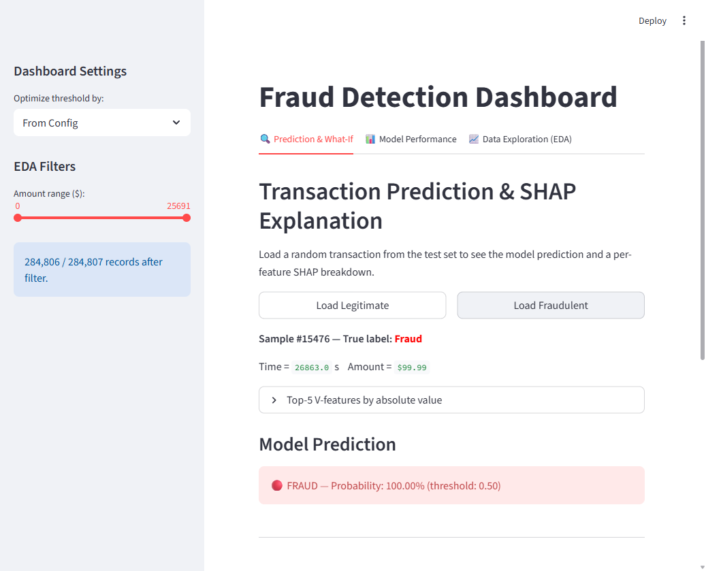
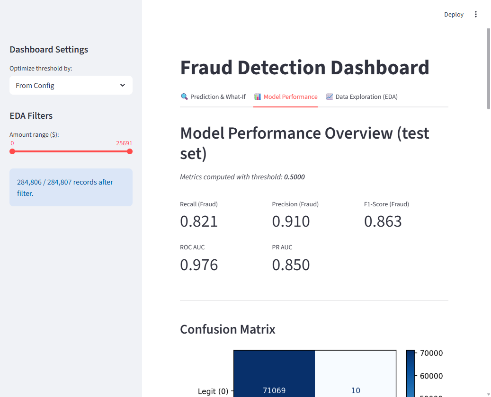
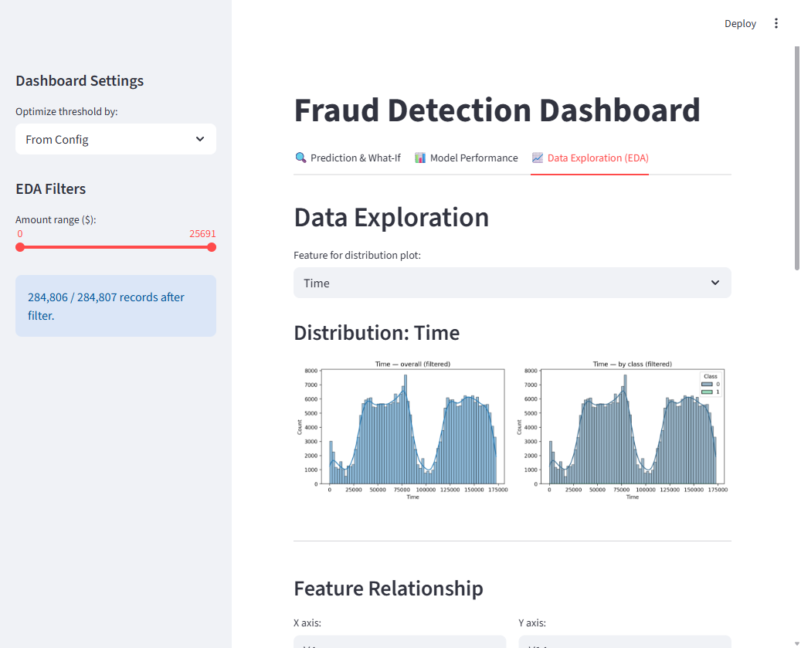

# Fraud Detection — LightGBM + SHAP + Streamlit


End-to-end fraud detection on credit card transactions: feature engineering, LightGBM, SHAP explainability, and an interactive Streamlit dashboard — deployed to Streamlit Cloud and packaged in Docker.

## Live Demo

[](https://frauddetection-fyfacu5knprcf8ngxjnhxn.streamlit.app/)

> Hosted on Streamlit Community Cloud free tier — may need a moment to wake up after inactivity.

---

## Model Performance

| Metric | Value |
| --- | --- |
| ROC AUC | **0.976** |
| PR AUC | **0.850** |
| Recall (Fraud) | 0.821 |
| Precision (Fraud) | 0.910 |
| F1 (Fraud) | 0.863 |

Evaluated on held-out test set. Threshold optimized on validation set.

---

## Dataset

[Credit Card Fraud Detection](https://www.kaggle.com/datasets/mlg-ulb/creditcardfraud) (Kaggle) — 284,807 transactions, 492 fraudulent (0.17%). Features V1–V28 are PCA-anonymized; `Time` and `Amount` are raw.

> `data/creditcard.csv` is gitignored. Download from Kaggle and place in `data/` before training.

---

## Dashboard Features

Three tabs in the Streamlit app:

### 1. Prediction & What-If

- Load a random legitimate or fraudulent transaction from the test set
- Adjust `Time`, `Amount`, and the most influential V-features in real time
- See the updated prediction and SHAP waterfall / force plots instantly

### 2. Model Performance

- Key metrics: Recall, Precision, F1, ROC AUC, PR AUC
- Interactive threshold selector (optimize for F1 / Recall / Precision)
- Confusion matrix, global SHAP feature importance bar plot

### 3. EDA

- Interactive histograms by class (fraud vs. legitimate)
- Amount range filter
- Scatter plot for any two features (5,000-sample subset)
- Per-class summary statistics

## Screenshots

| Prediction & What-If | Model Performance | Data Exploration |
|:---:|:---:|:---:|
|  |  |  |

---

## Feature Engineering

| Feature | Transformation |
| --- | --- |
| `Time` | Cyclic encoding — `sin` and `cos` of 24-hour period |
| `Amount` | `log1p` → `RobustScaler` |
| V1–V28 | `RobustScaler` |

---

## Project Structure

```
Fraud_Detection/
├── data/
│   └── creditcard.csv        # gitignored — download from Kaggle
├── models/                   # saved artifacts (model, SHAP explainer, metrics)
├── notebooks/
│   └── EDA.ipynb
├── src/
│   ├── __init__.py
│   ├── config.py             # paths, model params, threshold
│   ├── utils.py              # I/O helpers
│   ├── data_preprocessing.py # feature engineering transformers
│   ├── pipeline.py           # sklearn Pipeline assembly
│   └── train.py              # training, evaluation, artifact saving
├── app.py                    # Streamlit dashboard (3 tabs)
├── main.py                   # entrypoint → calls src.train
├── Dockerfile
├── requirements.txt
└── .gitignore
```

---

## Quick Start

### Local

```bash
git clone https://github.com/DinoZawrik/Fraud_Detection.git
cd Fraud_Detection
python -m venv .venv && source .venv/bin/activate  # Windows: .venv\Scripts\activate
pip install -r requirements.txt
# place creditcard.csv in data/
python main.py          # train model, save artifacts to models/
streamlit run app.py    # open http://localhost:8501
```

### Docker

```bash
docker build -t fraud-detection .
docker run -p 8501:8501 --rm fraud-detection
# open http://localhost:8501
```

---

## Stack

| Layer | Tools |
| --- | --- |
| Data | Pandas, NumPy |
| Modeling | LightGBM, scikit-learn, imbalanced-learn |
| Explainability | SHAP (TreeExplainer) |
| Dashboard | Streamlit |
| Visualization | Matplotlib, Seaborn |
| Serialization | Joblib |
| Deployment | Docker, Streamlit Community Cloud |
